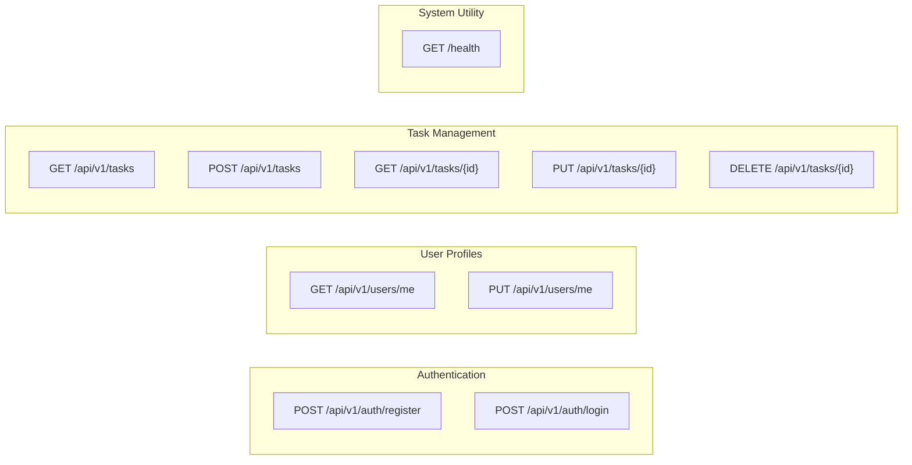

# API Tour - TaskFlow API Endpoints

This document maps out the endpoint routes and payload schemas planned for the TaskFlow API.

---

## Endpoint Map



---

## Planned API Route Reference

### 1. Authentication Endpoints

#### `POST /api/v1/auth/register`
- **Goal**: Register a new user in the database.
- **Request Body**:
  ```json
  {
    "username": "example_user",
    "email": "user@example.com",
    "password": "strongpassword123"
  }
  ```
- **Response**: `201 Created` with created user summary.

#### `POST /api/v1/auth/login`
- **Goal**: Verify user credentials and issue an authentication token.
- **Request Body**:
  ```json
  {
    "username": "example_user",
    "password": "strongpassword123"
  }
  ```
- **Response**: `200 OK` with JWT token.

---

### 2. User Settings

#### `GET /api/v1/users/me`
- **Goal**: Fetch current authenticated user's details.
- **Headers**: `Authorization: Bearer <token>`
- **Response**: `200 OK` with user details.

#### `PUT /api/v1/users/me`
- **Goal**: Update profile details of the current authenticated user.
- **Headers**: `Authorization: Bearer <token>`
- **Response**: `200 OK` with updated user details.

---

### 3. Task Management

#### `GET /api/v1/tasks`
- **Goal**: Retrieve list of tasks owned by the authenticated user.
- **Query Params**: `status` (completed/pending), `skip` (pagination offset), `limit` (pagination page size).
- **Headers**: `Authorization: Bearer <token>`
- **Response**: `200 OK` with list of task objects.

#### `POST /api/v1/tasks`
- **Goal**: Create a new task.
- **Headers**: `Authorization: Bearer <token>`
- **Request Body**:
  ```json
  {
    "title": "Build scaffold",
    "description": "Initialize repository structure",
    "due_date": "2026-07-20T12:00:00Z"
  }
  ```
- **Response**: `201 Created` with the newly created task.

#### `GET /api/v1/tasks/{id}`
- **Goal**: Fetch a single task by ID.
- **Headers**: `Authorization: Bearer <token>`
- **Response**: `200 OK` with task details.

#### `PUT /api/v1/tasks/{id}`
- **Goal**: Update details or change status of a specific task.
- **Headers**: `Authorization: Bearer <token>`
- **Response**: `200 OK` with updated task details.

#### `DELETE /api/v1/tasks/{id}`
- **Goal**: Delete a task.
- **Headers**: `Authorization: Bearer <token>`
- **Response**: `204 No Content`.

---

### 4. Health Check

#### `GET /health`
- **Goal**: Perform immediate service connectivity diagnostics.
- **Response**:
  ```json
  {
    "status": "ok",
    "database": "connected"
  }
  ```
