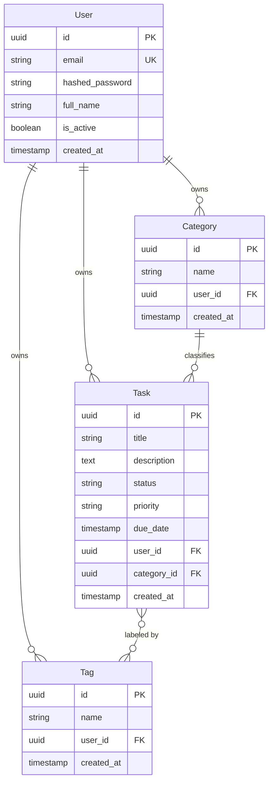
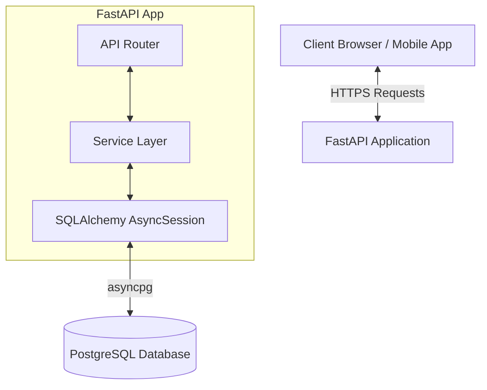
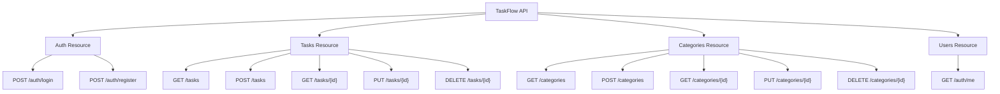
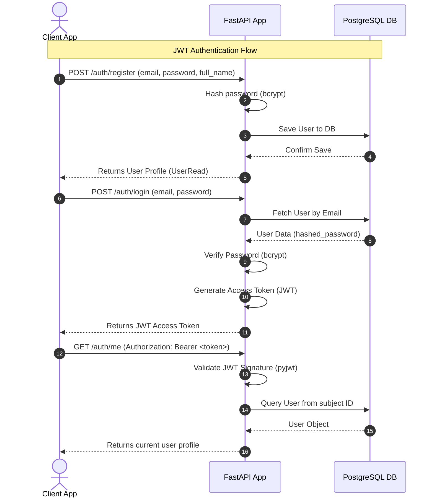
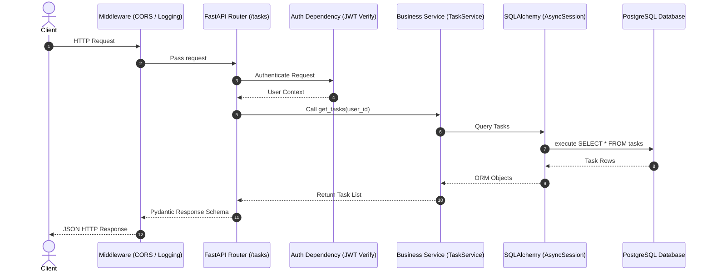
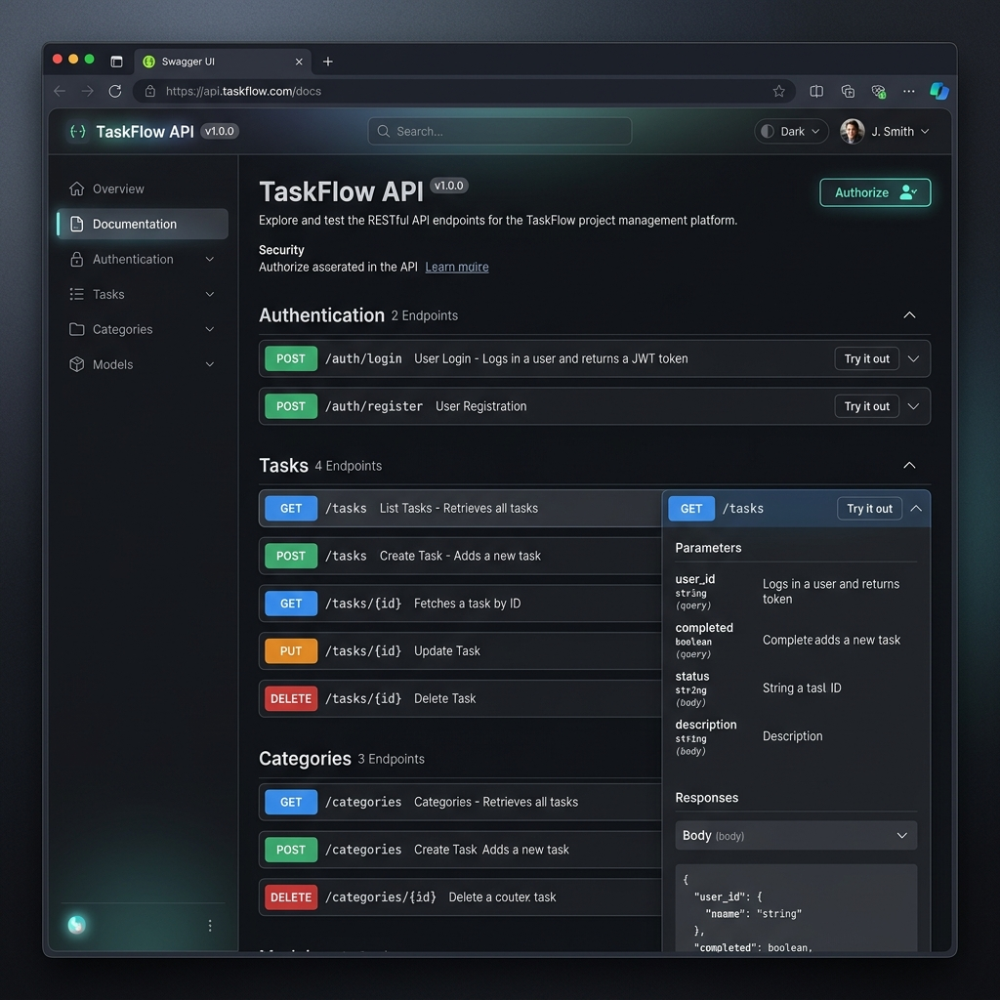

# TaskFlow API

[](https://github.com/nandakumar-nandu/TaskFlowAPI/actions/workflows/ci.yml)

TaskFlow API is a production-ready, high-performance, asynchronous REST API built with Python, FastAPI, and PostgreSQL. It is designed to serve as a robust task management platform with built-in JWT authentication, task filtering, sorting, pagination, and database migrations.

## Tech Stack

<div align="center">


</div>

---

## Database Schema (ER Diagram)

The relationship diagram below maps out user profiles, task structures, categories, and tags in the database:



---

## Architecture Overview

TaskFlow API follows a clean layer separation architecture to isolate business concerns:



---

## Planned API Endpoints

The planned API endpoints are structured by resource domain:



### Endpoints Status Reference Table

| Resource | Method | Path | Description | Status |
| :--- | :--- | :--- | :--- | :--- |
| **Auth** | `POST` | `/auth/register` | Register a new user | Done (Commit 2) |
| **Auth** | `POST` | `/auth/login` | Authenticate user credentials & return JWT | Done (Commit 2) |
| **Auth** | `GET` | `/auth/me` | Retrieve profile of the current authenticated user | Done (Commit 2) |
| **Tasks** | `GET` | `/tasks` | Retrieve paginated tasks owned by user with filter & sort | Done (Commit 4) |
| **Tasks** | `POST` | `/tasks` | Create a new task (with optional category and tags) | Done (Commit 4) |
| **Tasks** | `GET` | `/tasks/{id}` | Retrieve details of a specific task by ID | Done (Commit 3) |
| **Tasks** | `PUT` | `/tasks/{id}` | Update details, category, or tags of a specific task | Done (Commit 4) |
| **Tasks** | `DELETE` | `/tasks/{id}` | Delete a specific task by ID | Done (Commit 3) |
| **Categories** | `GET` | `/categories` | Retrieve all categories owned by user | Done (Commit 4) |
| **Categories** | `POST` | `/categories` | Create a new category | Done (Commit 4) |
| **Categories** | `GET` | `/categories/{id}` | Retrieve details of a specific category by ID | Done (Commit 4) |
| **Categories** | `PUT` | `/categories/{id}` | Update a specific category's name | Done (Commit 4) |
| **Categories** | `DELETE` | `/categories/{id}` | Delete a category (tasks' category is set to NULL) | Done (Commit 4) |
| **Utility** | `GET` | `/health` | Verify database & server health check | Done (Commit 1) |

### `GET /tasks` Query Parameters Reference Table

| Parameter | Type | Required | Default | Description |
| :--- | :--- | :---: | :--- | :--- |
| `status` | `string` | No | - | Filter by status: `todo`, `in_progress`, `done` |
| `priority` | `string` | No | - | Filter by priority: `low`, `medium`, `high` |
| `category_id` | `uuid` | No | - | Filter tasks associated with a specific category UUID |
| `tag` | `string` | No | - | Filter tasks associated with a specific tag name |
| `page` | `integer` | No | `1` | Pagination page number (starts at 1) |
| `limit` | `integer` | No | `10` | Maximum number of tasks to return per page |
| `sort` | `string` | No | `created_at` | Sort column: `due_date`, `created_at`, `priority`, `status`, `title` |
| `order` | `string` | No | `desc` | Sort direction: `asc` (ascending) or `desc` (descending) |


---

## JWT Authentication Flow

The sequence diagram below displays the end-to-end user registration and JWT token request lifecycle:



---

## Request Lifecycle

The standard flow of an incoming HTTP request through the API layer:



---

## Local Setup Prerequisites

Ensure you have the following installed on your machine:
- **Python**: Version 3.11 or later.
- **PostgreSQL**: Local server or Docker container running PostgreSQL.
- **Tools**: Command-line terminal configured with Python (e.g. bash, zsh, powershell).

---

## Running Tests

TaskFlow API uses **pytest** and **pytest-cov** to validate application code and measure test coverage.

### 🧪 Run the Test Suite
To execute the entire integration and unit test suite, run:
```bash
# Windows PowerShell
.venv\Scripts\pytest

# Linux/macOS
.venv/bin/pytest
```

### 📊 Run Tests with Coverage Report
To run all tests and generate a coverage summary table directly in the terminal, run:
```bash
# Windows PowerShell
.venv\Scripts\pytest --cov=app tests/

# Linux/macOS
.venv/bin/pytest --cov=app tests/
```

### 🏷️ Generating a Coverage Badge
To generate a dynamic coverage badge image (`coverage.svg`), you can use the `coverage-badge` CLI:
1. Install `coverage-badge`:
   ```bash
   .venv\Scripts\pip install coverage-badge
   ```
2. Generate the badge SVG file:
   ```bash
   .venv\Scripts\coverage-badge -o coverage.svg
   ```
This reads the latest `.coverage` file in the project root and outputs an SVG badge representing the coverage percentage (e.g., `91%`).

---

## Docker Setup

TaskFlow API is fully containerized using **Docker** and **Docker Compose**, providing a consistent local environment for development and production deployments.

### 🐳 Services Configured
- **`api`**: The FastAPI application server (port `8000`).
- **`db`**: A PostgreSQL 15 database instance (port `5432`).
- **`pgadmin`**: A web-based PostgreSQL administration interface (port `5050`).

### 🚀 Running the Containers
To build the application image and launch all services in the background, run:
```bash
docker-compose up --build -d
```

Once execution completes:
- **FastAPI Endpoints**: Access the API server at [http://localhost:8000](http://localhost:8000)
- **Interactive OpenAPI Documentation**: Open [http://localhost:8000/docs](http://localhost:8000/docs)
- **pgAdmin Console**: Login to the database administrator panel at [http://localhost:5050](http://localhost:5050) using:
  - **Email**: `admin@taskflow.local`
  - **Password**: `admin_secure_pwd`

To stop and remove active containers and network settings, run:
```bash
docker-compose down
```

To stop containers and wipe persistent PostgreSQL database volumes, run:
```bash
docker-compose down -v
```

---

## Interactive Swagger API Documentation

FastAPI automatically parses endpoint routing, models schemas, and security scopes to render an interactive Swagger UI dashboard. 

You can view response schemas, parameter configurations, and trigger requests directly from the browser:


