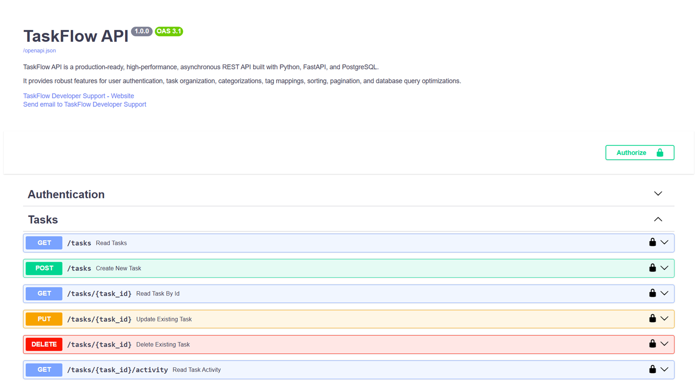
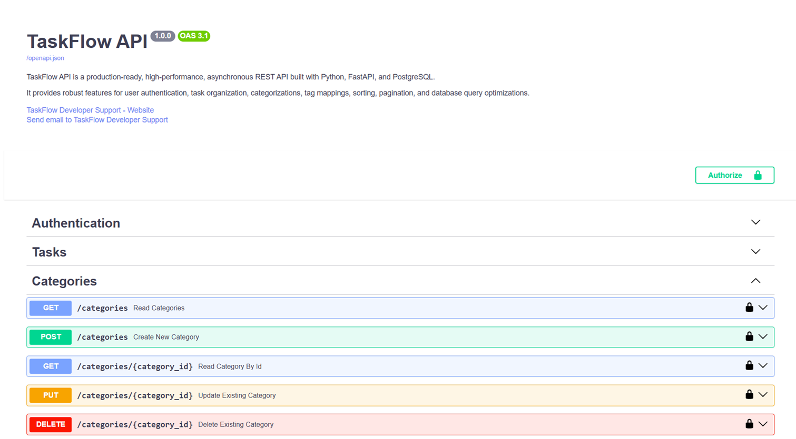
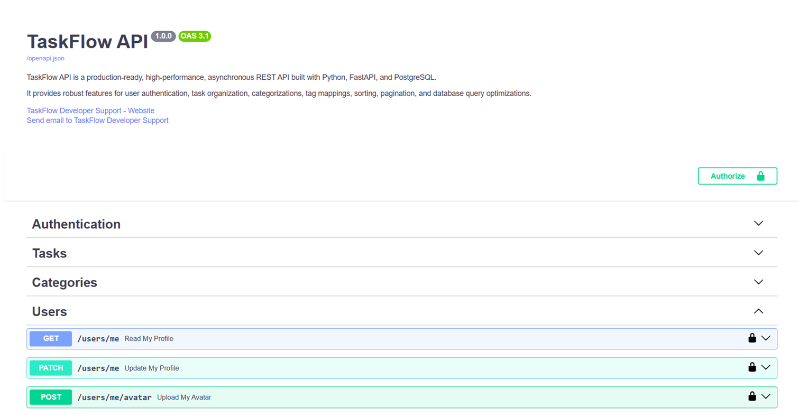
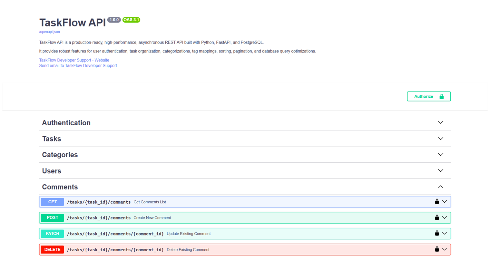
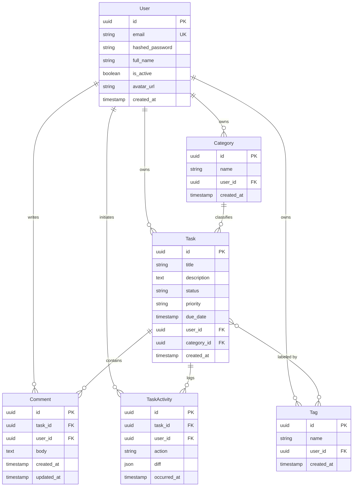
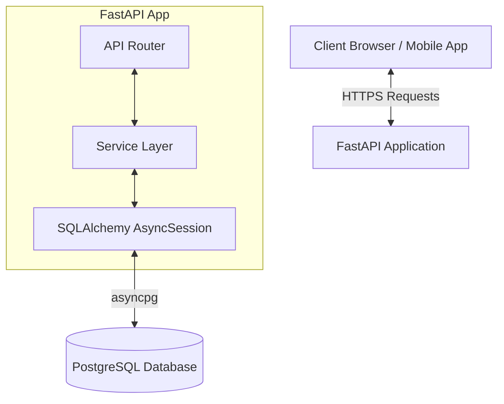
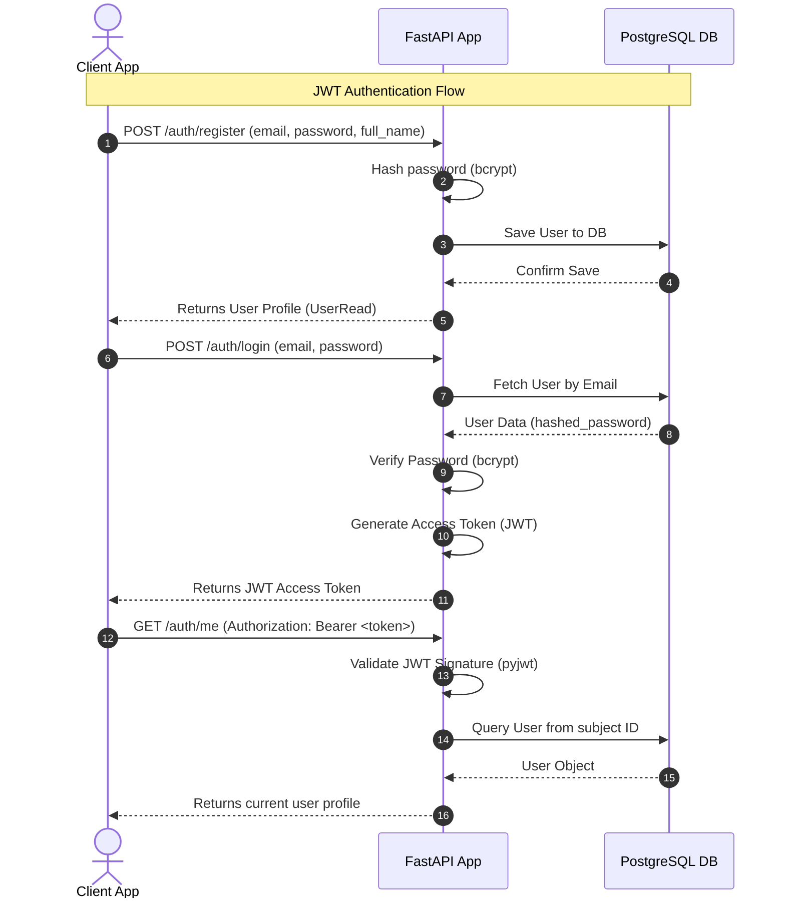
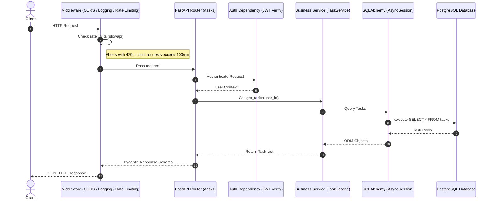

# TaskFlow API

[](https://github.com/nandakumar-nandu/TaskFlowAPI/actions/workflows/ci.yml)

TaskFlow API is a production-ready, high-performance, asynchronous REST API built with Python, FastAPI, and PostgreSQL. It is designed to serve as a robust task management platform with built-in JWT authentication, task filtering, sorting, pagination, and database migrations.


## Tech Stack

<div align="center">


</div>

---

## Screens

 | Tasks | Categories |
|---|---|
|  |  |

| Users | Comments |
|---|---|
|  |  | 


## Database Schema (ER Diagram)

The relationship diagram below maps out user profiles, task structures, categories, and tags in the database:



---

## Architecture Overview

TaskFlow API follows a clean layer separation architecture to isolate business concerns:



---

## API Endpoints Structure

The API endpoints are structured by resource domain:

```mermaid
graph TD
    API[TaskFlow API]
    API --> Auth[Auth Domain]
    API --> Users[Users Domain]
    API --> Tasks[Tasks Domain]
    API --> Categories[Categories Domain]
    API --> Comments[Comments Domain]
    API --> Health[Utility Health]

    Auth --> POST_Login[POST /auth/login]
    Auth --> POST_Register[POST /auth/register]
    Auth --> GET_Me[GET /auth/me]

    Users --> GET_UserMe[GET /users/me]
    Users --> PATCH_UserMe[PATCH /users/me]
    Users --> POST_Avatar[POST /users/me/avatar]

    Tasks --> GET_Tasks[GET /tasks]
    Tasks --> POST_Tasks[POST /tasks]
    Tasks --> GET_Task["GET /tasks/{id}"]
    Tasks --> PUT_Task["PUT /tasks/{id}"]
    Tasks --> DELETE_Task["DELETE /tasks/{id}"]
    Tasks --> GET_Activity["GET /tasks/{id}/activity"]

    Categories --> GET_Categories[GET /categories]
    Categories --> POST_Categories[POST /categories]
    Categories --> GET_Category["GET /categories/{id}"]
    Categories --> PUT_Category["PUT /categories/{id}"]
    Categories --> DELETE_Category["DELETE /categories/{id}"]

    Comments --> GET_Comments["GET /tasks/{task_id}/comments"]
    Comments --> POST_Comments["POST /tasks/{task_id}/comments"]
    Comments --> PATCH_Comment["PATCH /tasks/{task_id}/comments/{id}"]
    Comments --> DELETE_Comment["DELETE /tasks/{task_id}/comments/{id}"]

    Health --> GET_Health[GET /health]
```



### API Endpoint Reference Table

| Domain | HTTP Method | Path | Authentication | Request Payload / Params | Success Response | Description |
| :--- | :---: | :--- | :---: | :--- | :---: | :--- |
| **Auth** | `POST` | `/auth/register` | None | `UserCreate` JSON body | `201 Created` (`UserRead`) | Registers a new user account |
| **Auth** | `POST` | `/auth/login` | None | `UserLogin` JSON body | `200 OK` (`Token` JWT) | Authenticates credentials and returns a JWT |
| **Auth** | `GET` | `/auth/me` | JWT Bearer | None | `200 OK` (`UserRead`) | Retrieves profile of the logged-in user |
| **Users** | `GET` | `/users/me` | JWT Bearer | None | `200 OK` (`UserRead`) | Retrieves profile of the logged-in user |
| **Users** | `PATCH` | `/users/me` | JWT Bearer | `UserUpdate` JSON body | `200 OK` (`UserRead`) | Partially updates user profile details |
| **Users** | `POST` | `/users/me/avatar` | JWT Bearer | Multipart file (image) | `200 OK` (`UserRead`) | Uploads an avatar image (Max 5MB, JPEG/PNG/WEBP) |
| **Tasks** | `GET` | `/tasks` | JWT Bearer | Query filters, sort, page | `200 OK` (`TaskListResponse`) | Retrieves paginated user tasks with filters & sorting |
| **Tasks** | `POST` | `/tasks` | JWT Bearer | `TaskCreate` JSON body | `201 Created` (`TaskRead`) | Creates a new task with categories and tags |
| **Tasks** | `GET` | `/tasks/{id}` | JWT Bearer | Path: Task UUID | `200 OK` (`TaskRead`) | Retrieves details of a specific user task |
| **Tasks** | `PUT` | `/tasks/{id}` | JWT Bearer | `TaskUpdate` JSON body | `200 OK` (`TaskRead`) | Updates properties, category, or tags of a task |
| **Tasks** | `DELETE` | `/tasks/{id}` | JWT Bearer | Path: Task UUID | `204 No Content` | Permanently deletes a task owned by the user |
| **Tasks** | `GET` | `/tasks/{id}/activity` | JWT Bearer | Query `limit` (default 50) | `200 OK` (`List[ActivityRead]`) | Retrieves append-only audit trail log for a task |
| **Categories** | `GET` | `/categories` | JWT Bearer | None | `200 OK` (`List[CategoryRead]`) | Retrieves all categories created by the user |
| **Categories** | `POST` | `/categories` | JWT Bearer | `CategoryCreate` JSON body | `201 Created` (`CategoryRead`) | Creates a new task category |
| **Categories** | `GET` | `/categories/{id}` | JWT Bearer | Path: Category UUID | `200 OK` (`CategoryRead`) | Retrieves details of a specific category |
| **Categories** | `PUT` | `/categories/{id}` | JWT Bearer | `CategoryUpdate` JSON body | `200 OK` (`CategoryRead`) | Updates name of an existing user category |
| **Categories** | `DELETE` | `/categories/{id}` | JWT Bearer | Path: Category UUID | `204 No Content` | Deletes category (associated tasks set category_id to NULL) |
| **Comments** | `GET` | `/tasks/{task_id}/comments` | JWT Bearer | None | `200 OK` (`List[CommentRead]`) | Retrieves comments associated with a task |
| **Comments** | `POST` | `/tasks/{task_id}/comments` | JWT Bearer | `CommentCreate` JSON body | `201 Created` (`CommentRead`) | Adds a comment to a task |
| **Comments** | `PATCH` | `/tasks/{task_id}/comments/{comment_id}` | JWT Bearer | `CommentUpdate` JSON body | `200 OK` (`CommentRead`) | Updates comment body text (Author check) |
| **Comments** | `DELETE` | `/tasks/{task_id}/comments/{comment_id}` | JWT Bearer | Path: task_id, comment_id | `204 No Content` | Deletes a comment (Author check) |
| **Utility** | `GET` | `/health` | None | None | `200 OK` (Health JSON) | Performs database and server connectivity check |

### `GET /tasks` Query Parameters Reference Table

| Parameter | Type | Required | Default | Description |
| :--- | :--- | :---: | :--- | :--- |
| `status` | `string` | No | - | Filter by status: `todo`, `in_progress`, `done` |
| `priority` | `string` | No | - | Filter by priority: `low`, `medium`, `high` |
| `category_id` | `uuid` | No | - | Filter tasks associated with a specific category UUID |
| `tag` | `string` | No | - | Filter tasks associated with a specific tag name |
| `page` | `integer` | No | `1` | Pagination page number (starts at 1) |
| `limit` | `integer` | No | `10` | Maximum number of tasks to return per page |
| `sort` | `string` | No | `created_at` | Sort column: `due_date`, `created_at`, `priority`, `status`, `title` |
| `order` | `string` | No | `desc` | Sort direction: `asc` (ascending) or `desc` (descending) |


---

## JWT Authentication Flow

The sequence diagram below displays the end-to-end user registration and JWT token request lifecycle:



---

## Request Lifecycle

The standard flow of an incoming HTTP request through the API layer, incorporating rate limiting and validation middleware:



---

## Local Setup Prerequisites

Ensure you have the following installed on your machine:
- **Python**: Version 3.11 or later.
- **PostgreSQL**: Local server or Docker container running PostgreSQL.
- **Tools**: Command-line terminal configured with Python (e.g. bash, zsh, powershell).

---

## Running Tests

TaskFlow API uses **pytest** and **pytest-cov** to validate application code and measure test coverage.

### 🧪 Run the Test Suite
To execute the entire integration and unit test suite, run:
```bash
# Windows PowerShell
venv\Scripts\pytest

# Linux/macOS
venv/bin/pytest
```

### 📊 Run Tests with Coverage Report
To run all tests and generate a coverage summary table directly in the terminal, run:
```bash
# Windows PowerShell
venv\Scripts\pytest --cov=app tests/

# Linux/macOS
venv/bin/pytest --cov=app tests/
```

### 🏷️ Generating a Coverage Badge
To generate a dynamic coverage badge image (`coverage.svg`), you can use the `coverage-badge` CLI:
1. Install `coverage-badge`:
   ```bash
   venv\Scripts\pip install coverage-badge
   ```
2. Generate the badge SVG file:
   ```bash
   venv\Scripts\coverage-badge -o coverage.svg
   ```
This reads the latest `.coverage` file in the project root and outputs an SVG badge representing the coverage percentage (e.g., `91%`).

## Docker Quickstart

TaskFlow API is fully containerized using **Docker** and **Docker Compose**, providing a consistent local environment for development and production deployments.

### 🐳 Services Configured
- **`api`**: The FastAPI application server (port `8000`).
- **`db`**: A PostgreSQL 15 database instance (port `5432`).
- **`pgadmin`**: A web-based PostgreSQL administration interface (port `5050`).

### 🚀 Running the Containers
To build the application image and launch all services in the background, run:
```bash
docker-compose up --build -d
```

Once execution completes:
- **FastAPI Endpoints**: Access the API server at [http://localhost:8000](http://localhost:8000)
- **Interactive OpenAPI Documentation**: Open [http://localhost:8000/docs](http://localhost:8000/docs)
- **pgAdmin Console**: Login to the database administrator panel at [http://localhost:5050](http://localhost:5050) using:
  - **Email**: `admin@taskflow.local`
  - **Password**: `admin_secure_pwd`

To stop and remove active containers and network settings, run:
```bash
docker-compose down
```

To stop containers and wipe persistent PostgreSQL database volumes, run:
```bash
docker-compose down -v
```

---

## Railway Cloud Deployment

TaskFlow API is pre-configured for instant deployment on [Railway](https://railway.app).

### 🚀 Step-by-Step Deployment Guide
1. **Prepare Project**: Sign in to Railway and create a new project.
2. **Link GitHub**: Click **Deploy from GitHub repo** and select your `TaskFlowAPI` repository.
3. **Provision Database**:
   - Add a **PostgreSQL** database service to your Railway workspace.
4. **Configure Environment Variables**:
   - Navigate to the **Variables** tab of the API service and add:
     - `DATABASE_URL`: Set to `${{ Postgres.DATABASE_PRIVATE_URL }}` (Railway automatically maps this private connection string between the database and the API).
     - `SECRET_KEY`: Enter a cryptographically secure random key string.
     - `ACCESS_TOKEN_EXPIRE_MINUTES`: Set to `30` or your preferred JWT lifetime.
5. **Auto Deployment**: Railway will automatically detect the [Dockerfile](file:///d:/projects/TaskFlowAPI/Dockerfile) and [Procfile](file:///d:/projects/TaskFlowAPI/Procfile), build your application container, run migrations, and publish the API.

## Swagger API Documentation

FastAPI automatically parses endpoint routing, models schemas, and security scopes to render an interactive Swagger UI dashboard. 

- **Local Development Link**: [Local API Docs](http://localhost:8000/docs)

You can view response schemas, parameter configurations, and execute API requests interactively directly from your browser.
