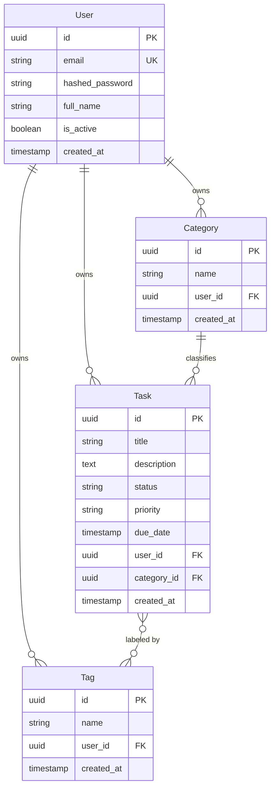
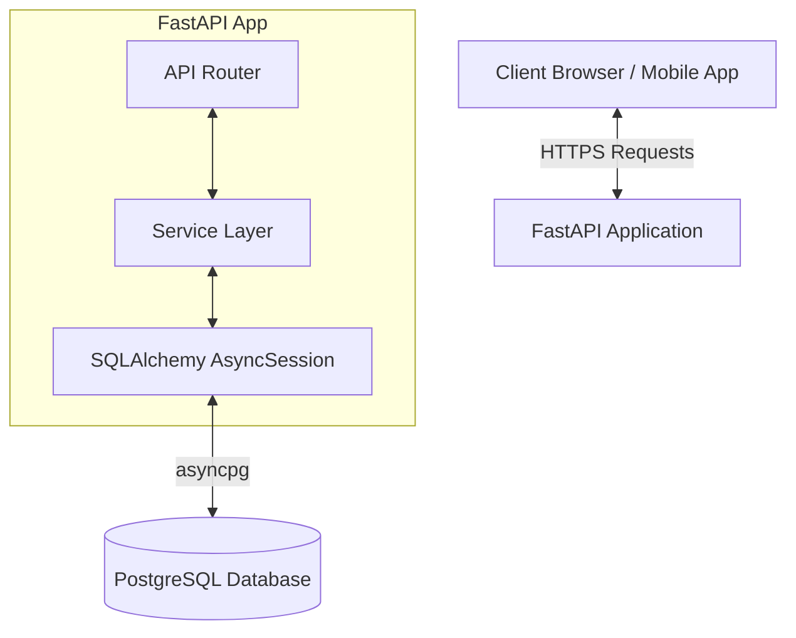
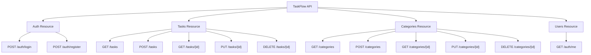
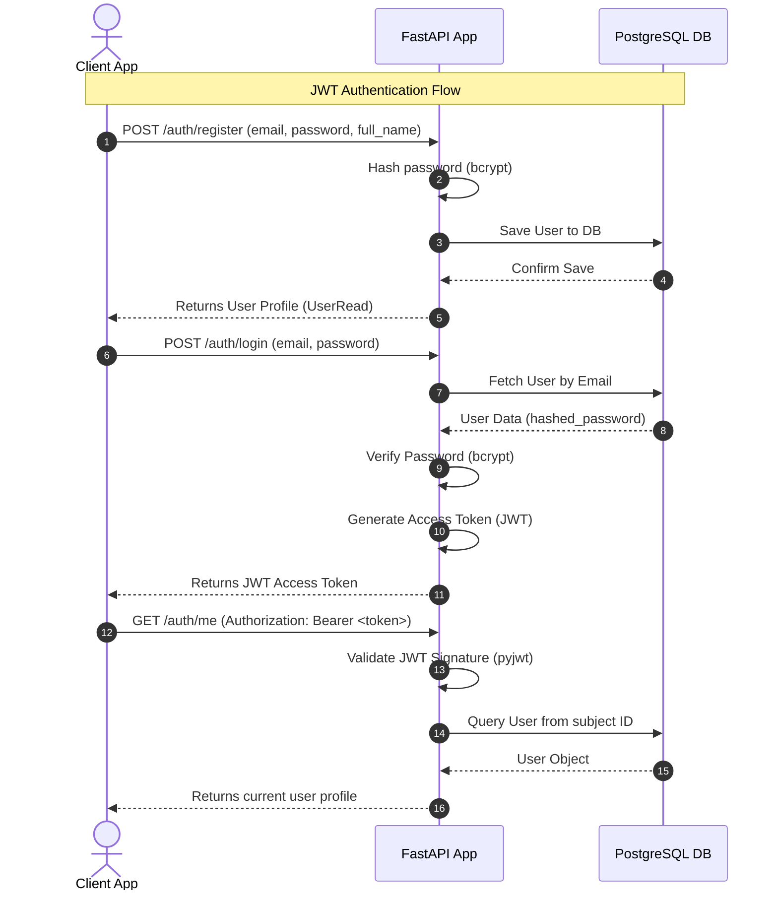
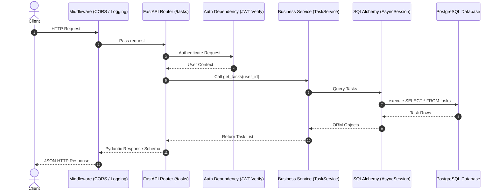

# TaskFlow API

TaskFlow API is a production-ready, high-performance, asynchronous REST API built with Python, FastAPI, and PostgreSQL. It is designed to serve as a robust task management platform with built-in JWT authentication, task filtering, sorting, pagination, and database migrations.

## Tech Stack

- **Language**: Python 3.11+
- **Web Framework**: FastAPI (v0.111.0)
- **ASGI Server**: Uvicorn (v0.30.1)
- **Database Engine**: SQLAlchemy (v2.0.31) with asyncpg driver (v0.29.0)
- **Database**: PostgreSQL (v15+)
- **Migrations**: Alembic (v1.13.2)
- **Settings Management**: Pydantic Settings (v2.3.4)
- **Tests**: Pytest (v8.2.2)

---

## Database Schema (ER Diagram)

The relationship diagram below maps out user profiles, task structures, categories, and tags in the database:

---

## Architecture Overview

TaskFlow API follows a clean layer separation architecture to isolate business concerns:

---

## Planned API Endpoints

The planned API endpoints are structured by resource domain:

### Endpoints Status Reference Table

| Resource | Method | Path | Description | Status |
| :--- | :--- | :--- | :--- | :--- |
| **Auth** | `POST` | `/auth/register` | Register a new user | Done (Commit 2) |
| **Auth** | `POST` | `/auth/login` | Authenticate user credentials & return JWT | Done (Commit 2) |
| **Auth** | `GET` | `/auth/me` | Retrieve profile of the current authenticated user | Done (Commit 2) |
| **Tasks** | `GET` | `/tasks` | Retrieve paginated tasks owned by user with filter & sort | Done (Commit 4) |
| **Tasks** | `POST` | `/tasks` | Create a new task (with optional category and tags) | Done (Commit 4) |
| **Tasks** | `GET` | `/tasks/{id}` | Retrieve details of a specific task by ID | Done (Commit 3) |
| **Tasks** | `PUT` | `/tasks/{id}` | Update details, category, or tags of a specific task | Done (Commit 4) |
| **Tasks** | `DELETE` | `/tasks/{id}` | Delete a specific task by ID | Done (Commit 3) |
| **Categories** | `GET` | `/categories` | Retrieve all categories owned by user | Done (Commit 4) |
| **Categories** | `POST` | `/categories` | Create a new category | Done (Commit 4) |
| **Categories** | `GET` | `/categories/{id}` | Retrieve details of a specific category by ID | Done (Commit 4) |
| **Categories** | `PUT` | `/categories/{id}` | Update a specific category's name | Done (Commit 4) |
| **Categories** | `DELETE` | `/categories/{id}` | Delete a category (tasks' category is set to NULL) | Done (Commit 4) |
| **Utility** | `GET` | `/health` | Verify database & server health check | Done (Commit 1) |

### `GET /tasks` Query Parameters Reference Table

| Parameter | Type | Required | Default | Description |
| :--- | :--- | :---: | :--- | :--- |
| `status` | `string` | No | - | Filter by status: `todo`, `in_progress`, `done` |
| `priority` | `string` | No | - | Filter by priority: `low`, `medium`, `high` |
| `category_id` | `uuid` | No | - | Filter tasks associated with a specific category UUID |
| `tag` | `string` | No | - | Filter tasks associated with a specific tag name |
| `page` | `integer` | No | `1` | Pagination page number (starts at 1) |
| `limit` | `integer` | No | `10` | Maximum number of tasks to return per page |
| `sort` | `string` | No | `created_at` | Sort column: `due_date`, `created_at`, `priority`, `status`, `title` |
| `order` | `string` | No | `desc` | Sort direction: `asc` (ascending) or `desc` (descending) |

---

## JWT Authentication Flow

The sequence diagram below displays the end-to-end user registration and JWT token request lifecycle:

---

## Request Lifecycle

The standard flow of an incoming HTTP request through the API layer:

---

## Local Setup Prerequisites

Ensure you have the following installed on your machine:
- **Python**: Version 3.11 or later.
- **PostgreSQL**: Local server or Docker container running PostgreSQL.
- **Tools**: Command-line terminal configured with Python (e.g. bash, zsh, powershell).
