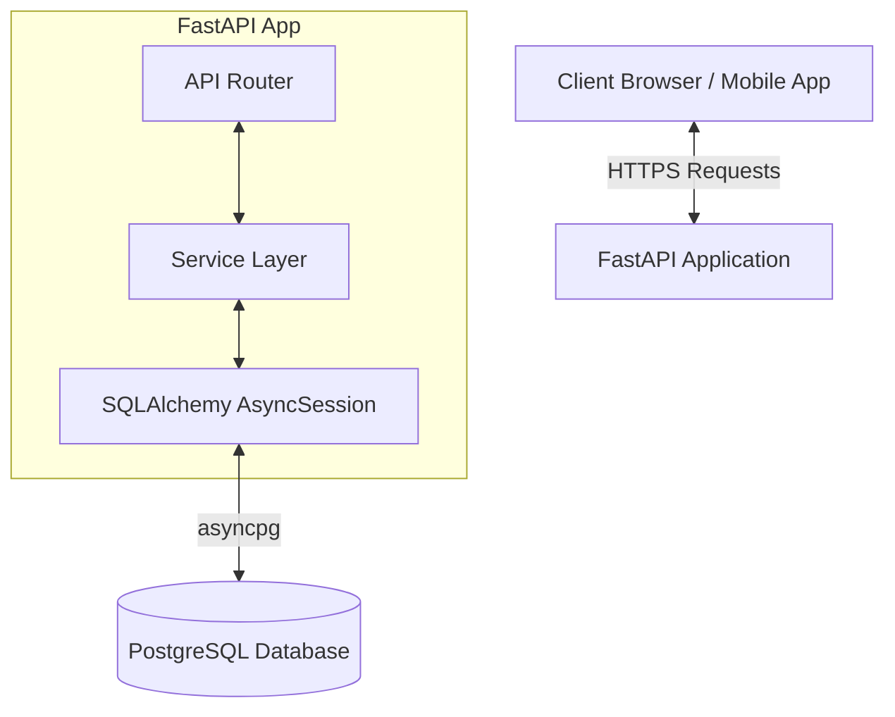
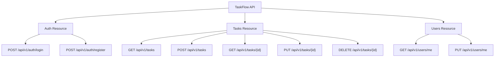
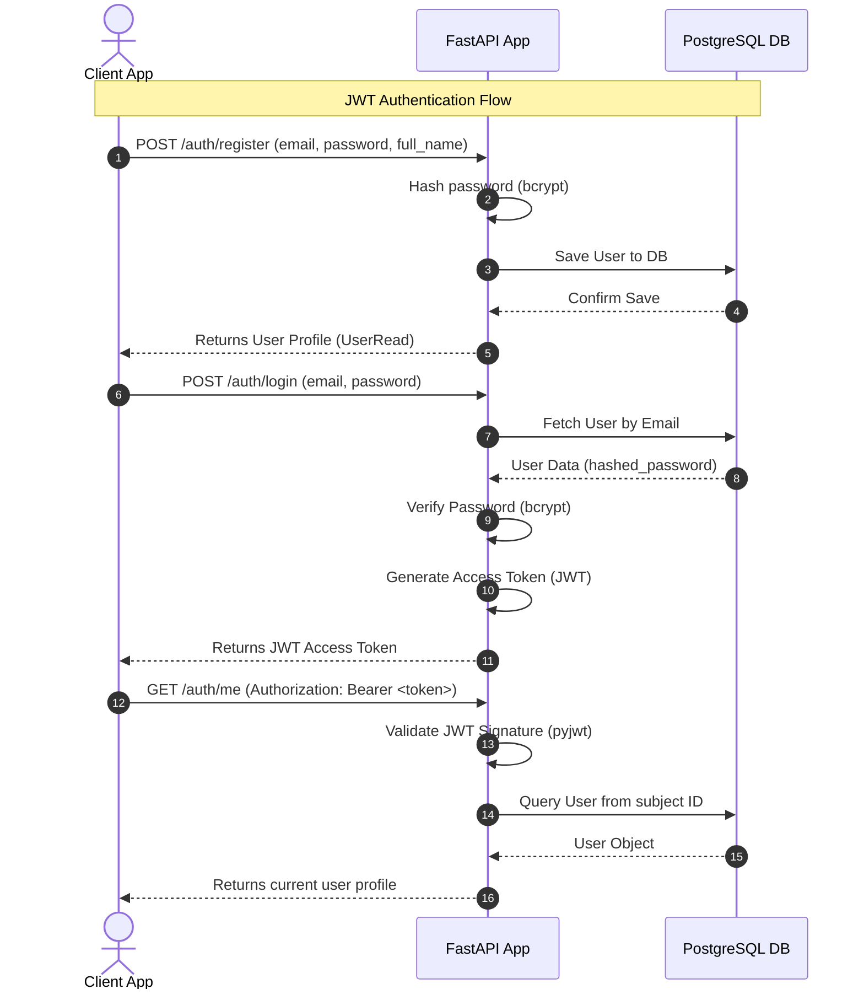
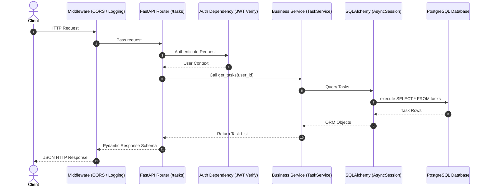

# TaskFlow API

TaskFlow API is a production-ready, high-performance, asynchronous REST API built with Python, FastAPI, and PostgreSQL. It is designed to serve as a robust task management platform with built-in JWT authentication, task filtering, sorting, pagination, and database migrations.

## Tech Stack

- **Language**: Python 3.11+
- **Web Framework**: FastAPI (v0.111.0)
- **ASGI Server**: Uvicorn (v0.30.1)
- **Database Engine**: SQLAlchemy (v2.0.31) with asyncpg driver (v0.29.0)
- **Database**: PostgreSQL (v15+)
- **Migrations**: Alembic (v1.13.2)
- **Settings Management**: Pydantic Settings (v2.3.4)
- **Tests**: Pytest (v8.2.2)

---

## Architecture Overview

TaskFlow API follows a clean layer separation architecture to isolate business concerns:

---

## Planned API Endpoints

The planned API endpoints are structured by resource domain:

### Endpoints Status Reference Table

| Resource | Method | Path | Description | Status |
| :--- | :--- | :--- | :--- | :--- |
| **Auth** | `POST` | `/auth/register` | Register a new user | Done (Commit 2) |
| **Auth** | `POST` | `/auth/login` | Authenticate user credentials & return JWT | Done (Commit 2) |
| **Auth** | `GET` | `/auth/me` | Retrieve profile of the current authenticated user | Done (Commit 2) |
| **Utility** | `GET` | `/health` | Verify database & server health check | Done (Commit 1) |

---

## JWT Authentication Flow

The sequence diagram below displays the end-to-end user registration and JWT token request lifecycle:

---

## Request Lifecycle

The standard flow of an incoming HTTP request through the API layer:

---

## Local Setup Prerequisites

Ensure you have the following installed on your machine:
- **Python**: Version 3.11 or later.
- **PostgreSQL**: Local server or Docker container running PostgreSQL.
- **Tools**: Command-line terminal configured with Python (e.g. bash, zsh, powershell).
