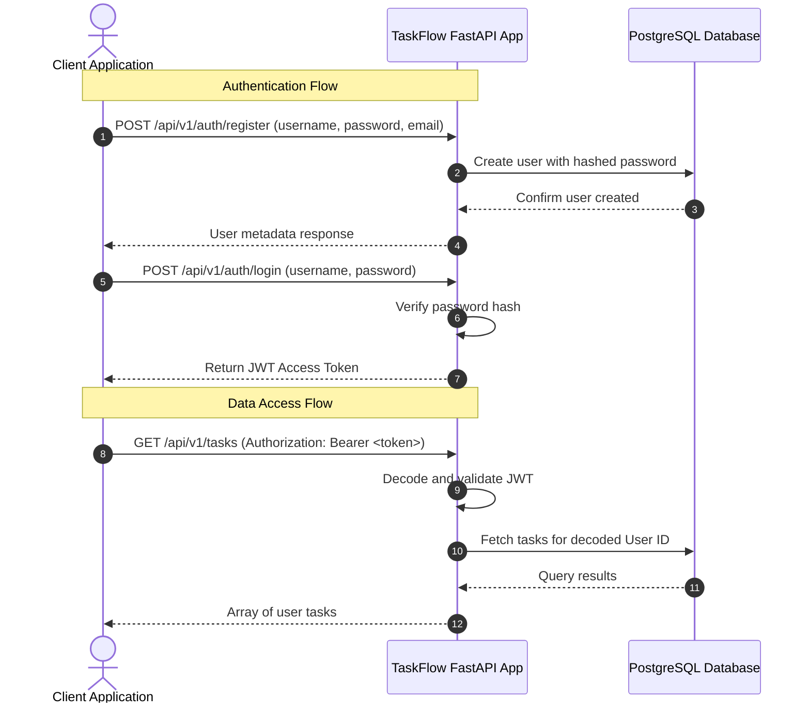

# Walkthrough - TaskFlow API Flow

TaskFlow API is built to help teams and developers easily orchestrate, manage, and audit their day-to-day work tasks. This document details the high-level workflow, authentication strategies, and data retrieval structures.

## API Overview & Use Cases

TaskFlow API provides core functionality to:
- **Register & Authenticate Users**: Secure password storage and session verification via JWT.
- **Manage Task Lifecycles**: Create, edit, assign, complete, and delete tasks.
- **Filter and Search**: Query tasks based on complete status, priority, and date limits.

---

## Authentication Flow (🚧 Work In Progress)

> [!NOTE]
> Authentication is not yet activated in Commit 1. Once implemented, it will utilize standard JSON Web Tokens (JWT) inside HTTP Authorization headers (`Authorization: Bearer <token>`).

The future authorization pipeline is designed as follows:
- **Password Encryption**: Scrypt or bcrypt algorithms to store securely hashed user passwords in the DB.
- **Token Generation**: Custom tokens containing cryptographic signatures, matching user identities and issue timestamps.
- **Route Guarding**: Dependencies configured on specific routes to extract and validate tokens before executing route actions.

---

## Planned User and Data Workflow

The diagram below outlines the full authentication and data-fetching flow that will be built:

