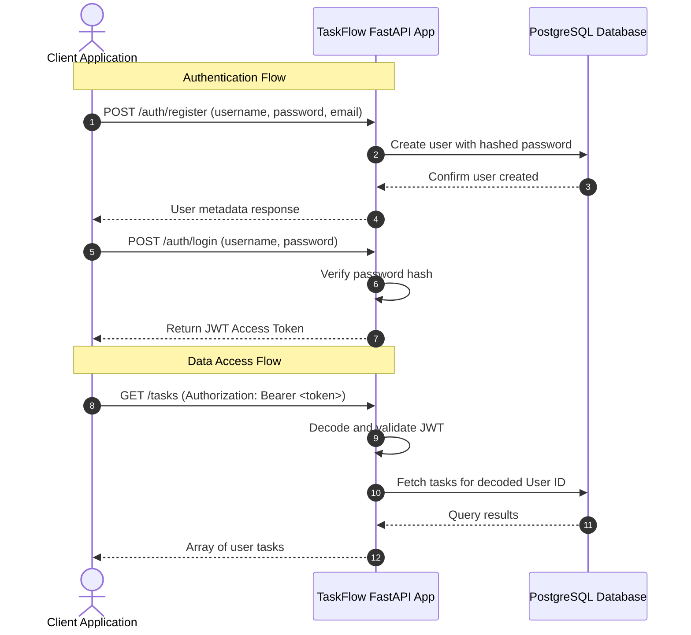

# Walkthrough - TaskFlow API Flow

TaskFlow API is built to help teams and developers easily orchestrate, manage, and audit their day-to-day work tasks. This document details the high-level workflow, authentication strategies, and data retrieval structures.

## API Overview & Use Cases

TaskFlow API provides core functionality to:
- **Register & Authenticate Users**: Secure password storage and session verification via JWT.
- **Manage Task Lifecycles**: Create, edit, assign, complete, and delete tasks.
- **Filter and Search**: Query tasks based on complete status, priority, and date limits.

---

## Authentication Flow

> [!NOTE]
> Authentication is fully implemented in Commit 2. It utilizes JSON Web Tokens (JWT) inside HTTP Authorization headers (`Authorization: Bearer <token>`).

The authorization pipeline operates as follows:
- **Password Encryption**: Uses the `bcrypt` library to securely hash and verify passwords during user registration and login, ensuring hashes are salted and resistant to timing and brute-force attacks.
- **Token Generation**: Uses the `pyjwt` library to sign JSON Web Tokens with a secure `HS256` HMAC algorithm using the application's `SECRET_KEY`.
- **Route Guarding**: FastAPI security dependency `HTTPBearer` extracts and decodes the token from the request header, loading the current user context directly into guarded endpoints.

---

## Planned User and Data Workflow

The diagram below outlines the full authentication and data-fetching flow that will be built:

---

## Testing

TaskFlow API employs a comprehensive integration testing framework built on **pytest** to ensure functional correctness, data security, and API reliability:

- **pytest-asyncio Integration**: As a fully asynchronous API, our test suite runs test cases asynchronously to match uvicorn/asyncpg execution patterns.
- **Dependency Overrides**: The tests dynamically override database dependencies (`get_db`) with transactional `AsyncMock(spec=AsyncSession)` sessions. This permits mocking complex database execution queries, return scalars, and model refreshes, avoiding database lockups and network roundtrips.
- **Shared Fixtures Configuration**: We consolidate testing setups inside [conftest.py](file:///d:/projects/TaskFlowAPI/tests/conftest.py), which exposes standard fixtures:
  - `db`: Isolates mock session instances per test run.
  - `client`: Initializes asynchronous ASGI clients to communicate with FastAPI endpoints.
  - `auth_user` & `auth_headers`: Provisions pre-configured authenticated contexts.
- **Coverage Reports**: Configured with `pytest-cov` to monitor testing coverage, ensuring critical routes, schemas, and services are covered by at least 80% coverage (attaining 91% total coverage).

---

## Containerization, Security, & Continuous Integration

TaskFlow API integrates robust security limits, container configuration, and automatic delivery checks:

- **Rate Limiting (Security)**: Integrates `slowapi` rate limiting middleware globally, enforcing an IP-based request threshold of **100 requests per minute**. Over-limit requests return standard `429 Too Many Requests` responses. The limiter is automatically bypassed during testing to prevent pipeline interference.
- **Dockerization**: The app is built on a custom [Dockerfile](file:///d:/projects/TaskFlowAPI/Dockerfile) leveraging a python-slim base image, multi-stage builder patterns, and clean pip upgrades.
- **Docker Compose Setup**: Development and hosting setups are automated using [docker-compose.yml](file:///d:/projects/TaskFlowAPI/docker-compose.yml), linking API servers, Postgres DB containers, and a dev-only pgAdmin GUI.
- **CI Pipelines (GitHub Actions)**: Every push or PR automatically runs [.github/workflows/ci.yml](file:///d:/projects/TaskFlowAPI/.github/workflows/ci.yml) validating environment installations and running the full integration test suite.

## Swagger UI Documentation

With updated schema models and description metadata, FastAPI serves a highly readable interactive documentation dashboard at `/docs`:

