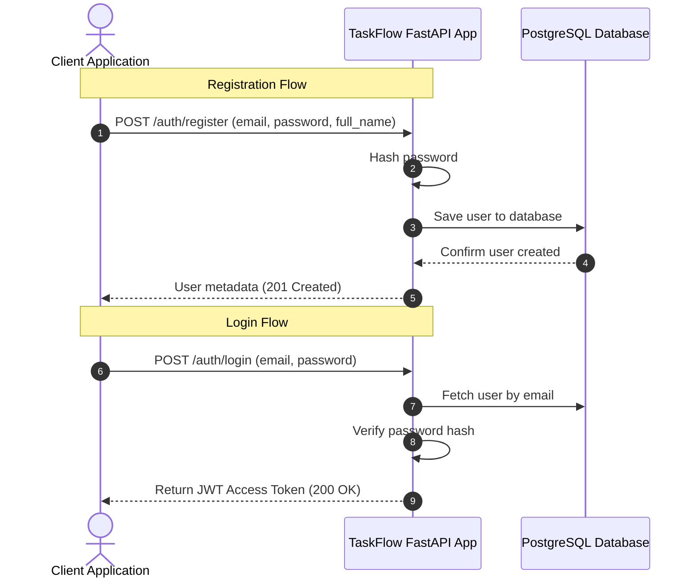
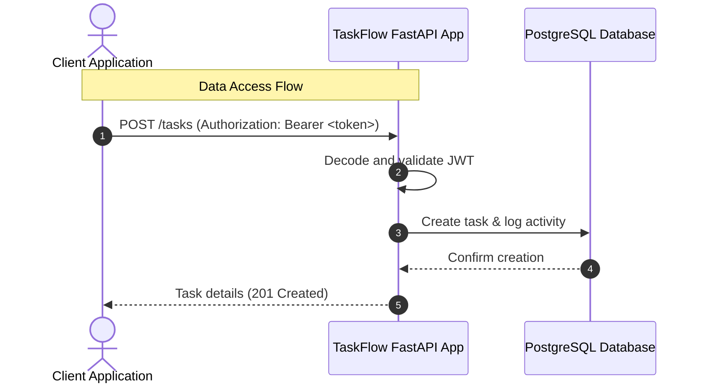

# Walkthrough - TaskFlow API Flow

TaskFlow API is built to help teams and developers easily orchestrate, manage, and audit their day-to-day work tasks. This document details the high-level workflow, authentication strategies, and data retrieval structures.

## API Overview & Use Cases

TaskFlow API provides core functionality to:
- **Register & Authenticate Users**: Secure password storage and session verification via JWT.
- **Manage Task Lifecycles**: Create, edit, assign, complete, and delete tasks.
- **Filter and Search**: Query tasks based on complete status, priority, and date limits.

---

## Authentication Flow

> [!NOTE]
> Authentication utilizes JSON Web Tokens (JWT) inside HTTP Authorization headers (`Authorization: Bearer <token>`).

The authorization pipeline operates as follows:
- **Password Encryption**: Uses the `bcrypt` library to securely hash and verify passwords during user registration and login, ensuring hashes are salted and resistant to timing and brute-force attacks.
- **Token Generation**: Uses the `pyjwt` library to sign JSON Web Tokens with a secure `HS256` HMAC algorithm using the application's `SECRET_KEY`.
- **Route Guarding**: FastAPI security dependency `HTTPBearer` extracts and decodes the token from the request header, loading the current user context directly into guarded endpoints.

---

## Planned User and Data Workflow

The diagrams below outline the authentication and data-fetching flows:

### 1. Registration and Login

### 2. Task Management Flow

---

## 8-Step API Walkthrough

See the Tutorial section in [README.md](file:///d:/Projects_Portfolio/TaskFlowAPI/README.md) for a step-by-step walkthrough.

---

## Deep Dive: Advanced Topics

### How Activity Logging Works
The `task_activity` table acts as an append-only audit trail. Whenever a task is created, updated, or deleted, the service layer explicitly logs a `TaskActivity` record in the same atomic database transaction. This prevents any inconsistencies and creates a permanent history.

### Understanding Ownership Checks
To enforce multi-tenant security, the API injects the `current_user` into service layer functions. Every database query implicitly scopes by `user_id`, guaranteeing that users can only ever access, modify, or delete resources they explicitly own.

---

## Containerization, Security, & Continuous Integration

TaskFlow API integrates robust security limits, container configuration, and automatic delivery checks:

- **Rate Limiting (Security)**: Integrates `slowapi` rate limiting middleware globally, enforcing an IP-based request threshold of **100 requests per minute**. Over-limit requests return standard `429 Too Many Requests` responses.
- **Dockerization**: The app is built on a custom `Dockerfile` leveraging a python-slim base image, multi-stage builder patterns, and clean pip upgrades.
- **Docker Compose Setup**: Development and hosting setups are automated using `docker-compose.yml`, linking API servers, Postgres DB containers, and a dev-only pgAdmin GUI.
- **CI Pipelines (GitHub Actions)**: Every push or PR automatically runs `.github/workflows/ci.yml` validating environment installations and running the full integration test suite.
