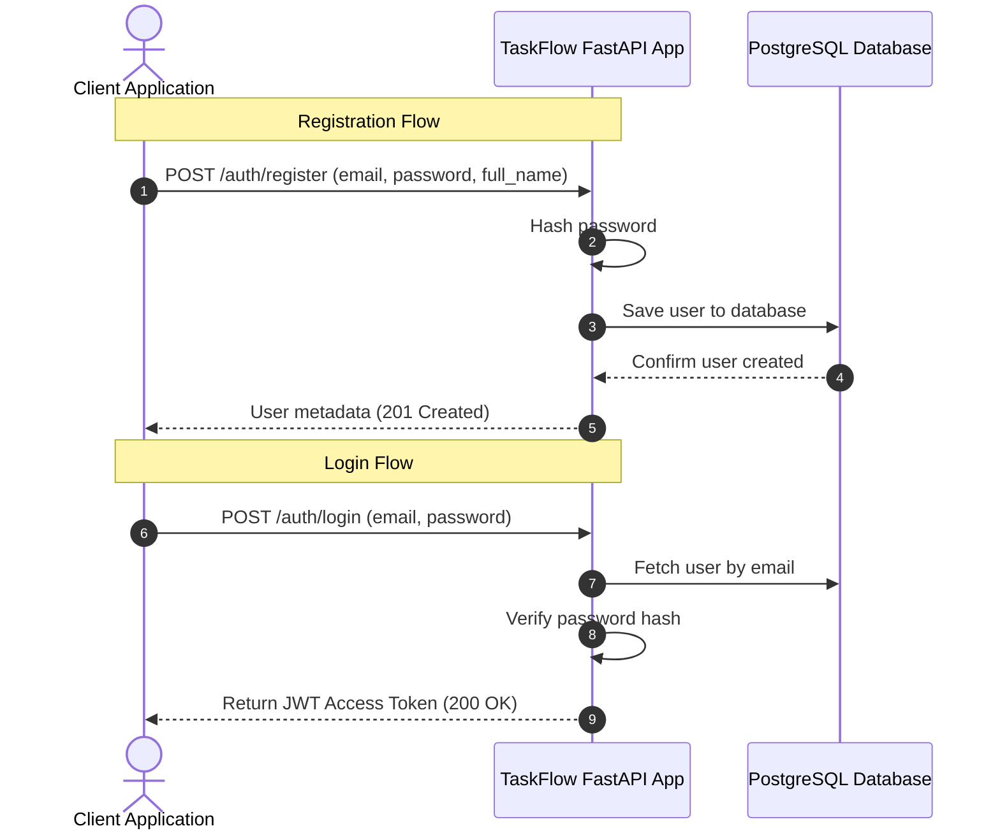
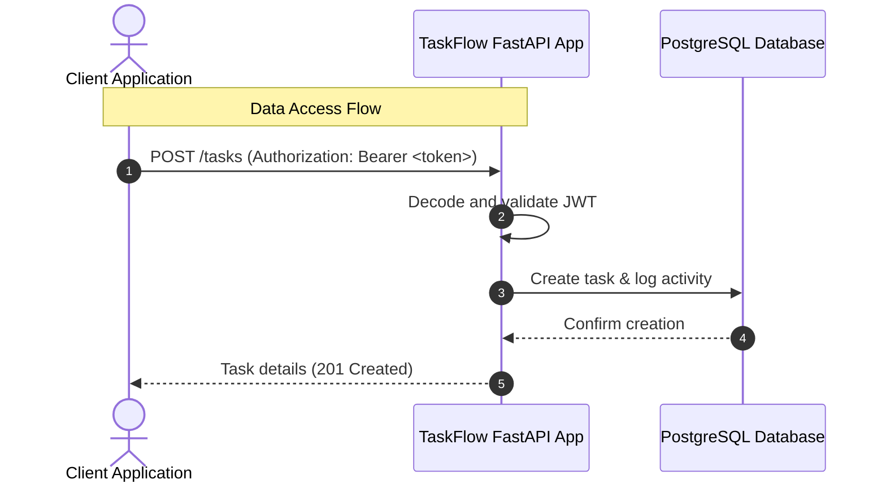

# Walkthrough - TaskFlow API Flow

TaskFlow API is built to help teams and developers easily orchestrate, manage, and audit their day-to-day work tasks. This document details the high-level workflow, authentication strategies, and data retrieval structures.

## API Overview & Use Cases

TaskFlow API provides core functionality to:
- **Register & Authenticate Users**: Secure password storage and session verification via JWT.
- **Manage Task Lifecycles**: Create, edit, assign, complete, and delete tasks.
- **Filter and Search**: Query tasks based on complete status, priority, and date limits.

---

## Authentication Flow

> [!NOTE]
> Authentication utilizes JSON Web Tokens (JWT) inside HTTP Authorization headers (`Authorization: Bearer <token>`).

The authorization pipeline operates as follows:
- **Password Encryption**: Uses the `bcrypt` library to securely hash and verify passwords during user registration and login, ensuring hashes are salted and resistant to timing and brute-force attacks.
- **Token Generation**: Uses the `pyjwt` library to sign JSON Web Tokens with a secure `HS256` HMAC algorithm using the application's `SECRET_KEY`.
- **Route Guarding**: FastAPI security dependency `HTTPBearer` extracts and decodes the token from the request header, loading the current user context directly into guarded endpoints.

---

## Planned User and Data Workflow

The diagrams below outline the authentication and data-fetching flows:

### 1. Registration and Login

### 2. Task Management Flow

---

## 8-Step API Walkthrough

Here is a step-by-step narrative of a typical user's journey through the API.

### Step 1: Register
- **Endpoint**: `POST /auth/register`
- **Request Payload**: `{"email": "user@example.com", "password": "securepassword", "full_name": "Test User"}`
- **Behind the Scenes**: The API receives the payload, hashes the password using `bcrypt`, creates a new `User` model, and commits it to the database.
- **Expected Response**: `201 Created` with the new user's metadata (excluding the password).

### Step 2: Login
- **Endpoint**: `POST /auth/login`
- **Request Payload**: `{"username": "user@example.com", "password": "securepassword"}`
- **Behind the Scenes**: The API fetches the user by email, verifies the password against the stored hash, and generates a JWT (JSON Web Token) signed with a secret key.
- **Expected Response**: `200 OK` with the `access_token` and `token_type` ("bearer").

### Step 3: Create Category
- **Endpoint**: `POST /categories`
- **Request Payload**: `{"name": "Work Projects"}` (Requires `Authorization: Bearer <token>` header)
- **Behind the Scenes**: The API decodes the JWT to find the user's ID. It then creates a new `Category` model linked to that user and saves it to the database.
- **Expected Response**: `201 Created` with the new category details (including its UUID).

### Step 4: Create Task with Tags
- **Endpoint**: `POST /tasks`
- **Request Payload**: `{"title": "Finish Report", "description": "Q3 Sales", "status": "todo", "priority": "high", "category_id": "<uuid-from-step-3>", "tags": ["urgent", "sales"]}`
- **Behind the Scenes**: The API validates the category belongs to the user. It creates the `Task`, finds or creates the requested `Tag`s, links them in the `task_tags` junction table, and creates a `TaskActivity` log entry recording the creation.
- **Expected Response**: `201 Created` with the task details, nested category, and array of tags.

### Step 5: Fetch Task List
- **Endpoint**: `GET /tasks?status=todo&priority=high`
- **Request Payload**: None (Query parameters used instead)
- **Behind the Scenes**: The API queries the database for tasks belonging to the user, applying the filters provided. It supports pagination and dynamic sorting.
- **Expected Response**: `200 OK` with a paginated array of tasks.

### Step 6: Add Comment
- **Endpoint**: `POST /tasks/<task-uuid>/comments`
- **Request Payload**: `{"body": "I need to ask Sarah for the Q3 numbers."}`
- **Behind the Scenes**: The API verifies the task belongs to the user, then creates a new `Comment` linked to the task and the user.
- **Expected Response**: `201 Created` with the comment details.

### Step 7: View Activity Log
- **Endpoint**: `GET /tasks/<task-uuid>/activity`
- **Request Payload**: None
- **Behind the Scenes**: The API queries the `task_activity` table for all logs related to this task, returning an append-only audit trail of who did what and when.
- **Expected Response**: `200 OK` with an array of activity logs (e.g., showing the task was "created").

### Step 8: Run Tests
- **Command**: `pytest --cov=app tests/`
- **Behind the Scenes**: The `pytest` framework spins up a test environment, using an in-memory SQLite database or a test PostgreSQL instance. It overrides the FastAPI `get_db` dependency to use test sessions, simulating HTTP requests via `httpx.AsyncClient`, and validates the API logic securely without affecting production data.
- **Expected Response**: A terminal output showing all tests passing and a coverage report indicating the percentage of code tested.

---

## Containerization, Security, & Continuous Integration

TaskFlow API integrates robust security limits, container configuration, and automatic delivery checks:

- **Rate Limiting (Security)**: Integrates `slowapi` rate limiting middleware globally, enforcing an IP-based request threshold of **100 requests per minute**. Over-limit requests return standard `429 Too Many Requests` responses.
- **Dockerization**: The app is built on a custom `Dockerfile` leveraging a python-slim base image, multi-stage builder patterns, and clean pip upgrades.
- **Docker Compose Setup**: Development and hosting setups are automated using `docker-compose.yml`, linking API servers, Postgres DB containers, and a dev-only pgAdmin GUI.
- **CI Pipelines (GitHub Actions)**: Every push or PR automatically runs `.github/workflows/ci.yml` validating environment installations and running the full integration test suite.
